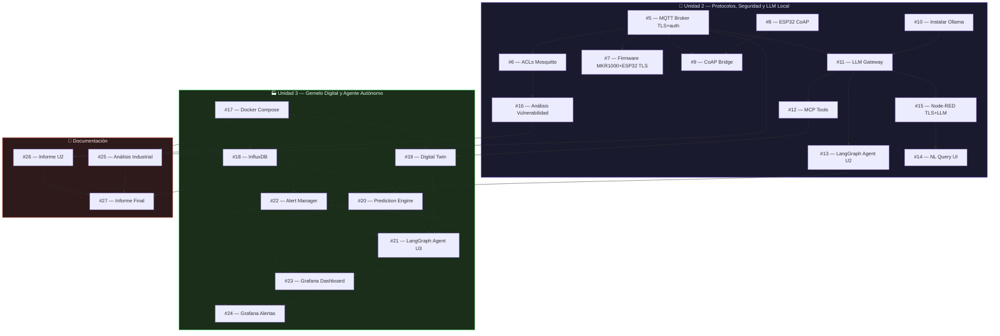

# Control de Acceso IoT — SmartHome equipo69

Sistema de control de acceso con reconocimiento facial y monitoreo ambiental
para una casa inteligente. Orquestado con Docker Compose, comunica sensores y
actuadores vía MQTT a través de un broker Mosquitto.

## Tabla de contenidos

- [Arquitectura](#arquitectura)
- [Levantar el proyecto](#levantar-el-proyecto)
- [Jerarquía MQTT](#jerarqu%C3%ADa-mqtt)
- [API REST](#api-rest)
- [Flashear firmware](#flashear-firmware)
- [Bot de Telegram](#bot-de-telegram)
- [Dashboard Node-RED](#dashboard-node-red)
- [Estructura del repositorio](#estructura-del-repositorio)
- [Roadmap Unidad 2 y 3](#roadmap-unidad-2-y-3)
- [Inventario](#inventario)
- [Diagrama de pines - MKR1000](#diagrama-de-pines--mkr1000)

## Arquitectura

```
┌──────────────┐     ┌──────────────┐     
│ MKR1000      │     │ ESP32-CAM    │     
│ sensores +   │     │ cámara       │     
│ actuadores   │     │ snapshot     │     
│ :1884 plain  │     │ :8883 TLS 🔐 │     
└──────┬───────┘     └──────┬───────┘     
       │ MQTT               │ MQTT                
       │                    │                    
       ▼                    ▼                    
┌──────────────────────────────────────────────────────┐
│                    Mosquitto                         │
│          :8883 TLS + auth  │  :1884 plain + auth    │
│          :1883 healthcheck (localhost)               │
└──────┬───────────────────────┬───────────────────────┘
       │                       │
       ▼                       ▼
┌──────────────┐     ┌──────────────────┐           ┌──────────────┐
│  Node-RED    │     │  Backend FastAPI │           │ Navegador    │
│  dashboard   │     │  face_recognition│           │ (frontend)   │
│  reglas      │     │  API REST :8000  │<----------│              │
│  Telegram    │     │  cliente MQTT 🔐 │  HTTP :80 └──────────────┘
│  histórico   │     │                  │
└──────────────┘     └──────────────────┘
```

**Componentes**:

| Componente | Rol | Detalle |
|---|---|---|
| **Arduino MKR1000** | Nodo sensor / actuador | Lee SHT30 (temp/humedad), MQ-2 (gas), MAX4466 (sonido). Controla LED alerta y LED puerta. Publica JSON de sensores cada 2s y recibe comandos ON/OFF por MQTT. |
| **ESP32-CAM** | Cámara bajo demanda | Recibe comandos MQTT (`camara/captura`) y captura frames en ráfaga (~4 fps durante 5s). Sin stream MJPEG — cada JPEG se publica vía MQTT. |
| **Mosquitto** | Broker MQTT seguro | Punto central de comunicación. Puerto 8883 con TLS + autenticación para servicios internos (backend, Node-RED, ESP32-CAM). Puerto 1884 sin TLS para MKR1000 (WiFi101 no compatible con TLS moderno). Healthcheck en 1883 (localhost). Certificados autofirmados generados en el build de Docker. |
| **Node-RED** | Dashboard + reglas + notificaciones | Dashboard web con variables, gráfico histórico y controles. Reglas automáticas (temperatura alta, gas alto). Bot de Telegram con comandos `/status` y `/ayuda`. Registro histórico en CSV. |
| **Backend FastAPI** | API REST + reconocimiento facial | Corre `face_recognition` (dlib). Captura bursts de 10s, detecta rostros conocidos, abre puerta si hay match, se puede guarda los rostros enrolados en una base de datos SQLite. Publica eventos vía MQTT. |
| **Frontend HTML/JS** | Interfaz de control | Servido por nginx (:80), consume la API vía polling. Muestra cámara en vivo (MJPEG relay), historial de accesos y enrolamiento de rostros desconocidos. |

**Equipo**: `equipo69` — presente como constante en firmware, backend y Node-RED.

## Levantar el proyecto

### Requisitos

- Docker 24+ y Docker Compose v2+
- Git
- `arduino-cli` (solo para flashear firmware)
- Token de Telegram (obtenelo con [@BotFather](https://t.me/BotFather))

### 1. Clonar el repo

```bash
git clone <repo-url> && cd IoT_Proyecto1
```

### 2. Configurar el `.env`

```bash
cp deploy/.env.example deploy/.env
```

Editá `deploy/.env` y poné tu token:

```ini
TELEGRAM_BOT_TOKEN=123456789:ABCdefGHIjklMNOpqrsTUVwxyz
TZ=America/Santiago
```

### 3. Levantar los servicios

```bash
cd deploy
docker compose up -d
```

Esto levanta 4 contenedores:

| Servicio | Puerto | Descripción |
|---|---|---|
| `mosquitto` | 8883 (TLS), 1884 (plain), 1883 (health) | Broker MQTT seguro |
| `nodered` | 1880 | Dashboard + reglas + Telegram |
| `backend` | 8000 | API REST + face recognition |
| `frontend` | 80 | Interfaz web |

### 4. Sincronizar CA cert con el firmware ESP32-CAM

```bash
./scripts/sync-ca-to-firmware.sh
```

> **¿Por qué?** El certificado CA autofirmado se genera durante `docker compose up`. La ESP32-CAM necesita ese CA cert embebido en su firmware para validar la conexión TLS. Este script lo extrae del volumen Docker y actualiza `src/esp32cam_firmware/src/secrets.h`.

### 5. Verificar

```bash
docker compose ps          # todos deben decir "running"
docker compose logs -f     # logs en tiempo real
```

Accedé:

- **Frontend**: http://localhost
- **Dashboard**: http://localhost:1880/ui
- **API docs**: http://localhost:8000/docs

### Apagar

```bash
docker compose down          # conserva volúmenes y datos
docker compose down -v       # borra TODO (reset completo)
```

## Jerarquía MQTT

Todos los tópicos usan el prefijo `smarthome/equipo69/`. Definidos en `src/mkr1000_firmware/src/config.h`, `src/esp32cam_firmware/src/config.h` y `src/backend/mqtt_client/client.py`. La ESP32-CAM solo define 3 tópicos: `evento`, `captura` e `imagen`.

### Sensores — MKR1000 → broker

| Tópico | Payload | Frecuencia |
|---|---|---|
| `smarthome/equipo69/datos` | JSON con `equipo`, `temperatura`, `humedad`, `gas`, `gas_digital`, `sensor_extra` | Cada 2 segundos |

Ejemplo:

```json
{
  "equipo": "equipo69",
  "temperatura": 23.5,
  "humedad": 61.2,
  "gas": 412,
  "gas_digital": "NORMAL",
  "sensor_extra": 128
}
```

### Alertas — MKR1000 → broker

| Tópico | Payload |
|---|---|
| `smarthome/equipo69/alerta` | Texto descriptivo de la alerta |

### Control de actuadores — broker → MKR1000

| Tópico | Payload | Efecto |
|---|---|---|
| `smarthome/equipo69/control/led` | `"ON"` / `"OFF"` | LED de alerta |
| `smarthome/equipo69/control/led-puerta` | `{"accion":"ON"}` / `{"accion":"OFF"}` | LED puerta (auto-apagado a los 3s) |

### Cámara — ESP32-CAM ↔ broker ↔ backend

| Tópico | Dirección | Payload |
|---|---|---|
| `smarthome/equipo69/camara/evento` | ESP32 → broker | `{"status":"camara_lista"}` / `{"estado":"burst_complete"}` |
| `smarthome/equipo69/camara/imagen` | ESP32 → broker | JPEG bytes (MQTT_MAX_PACKET_SIZE=65536) |
| `smarthome/equipo69/camara/captura` | backend → ESP32 | `{"accion":"iniciar_burst","duracion":5}` |

### Acceso — backend → broker

| Tópico | Payload |
|---|---|
| `smarthome/equipo69/acceso/estado` | `{"estado":"permitido","usuario":"Juan"}` o `{"estado":"denegado","usuario":"desconocido"}` |
| `smarthome/equipo69/acceso/enrolar` | `{"accion":"enrolar","timestamp":"..."}` |

### LLM (Unidad 2) — LLM Gateway ↔ broker

| Tópico | Dirección | Payload |
|---|---|---|
| `smarthome/equipo69/llm/decision` | LLM Gateway → broker | `{"nivel":"critico","razonamiento":"Gas elevado..."}` |
| `smarthome/equipo69/llm/respuesta` | LLM Gateway → broker | Respuesta en lenguaje natural a consultas del dashboard |

### QoS por tipo de mensaje

| Tipo | QoS | Retain |
|---|---|---|
| Sensores (datos) | 0 | No |
| Alertas | 1 | No |
| Comandos de control | 1 | Sí |
| Imágenes de cámara | 1 | No |

## API REST

Base: `http://localhost:8000/api` (o `http://localhost/api` a través de nginx).

### Endpoints

| Método | Ruta | Descripción |
|---|---|---|
| `GET` | `/api/ultimo-evento` | Último evento de acceso (incluye flag `enrollable` si hay rostro desconocido pendiente) |
| `GET` | `/api/historial?limit=50` | Últimos N eventos de acceso |
| `POST` | `/api/enrolar` | Enrola un rostro desconocido. Body: `{"nombre":"..."}` |
| `POST` | `/api/abrir-puerta` | Abre la puerta manualmente vía MQTT |
| `GET` | `/api/stream` | Stream MJPEG de la cámara (`multipart/x-mixed-replace`) |
| `POST` | `/api/capturar` | Inicia captura de 10 segundos (bloquea hasta terminar) |

### Flujo de reconocimiento facial

1. `POST /api/capturar` → backend publica `camara/captura` por MQTT.
2. ESP32-CAM recibe el comando e inicia ráfaga: captura frames a ~4 fps durante 5 segundos.
3. Cada JPEG se publica en `camara/imagen` (QoS 1) apenas se captura.
4. Backend recibe los frames, procesa en sub-bursts de 3 segundos con `face_recognition`.
5. Si reconoce a alguien → publica `acceso/estado: permitido` y `control/led-puerta: ON`.
6. Si detecta un rostro no reconocido → publica `acceso/enrolar` para que el frontend ofrezca enrolar.

### Respuesta de error

- **409** — ya hay una captura en progreso (`{"estado":"ocupado"}`)
- **400** — datos inválidos en enrolamiento
- **404** — enrolamiento expirado

## Flashear firmware

### Requisitos previos

```bash
# 1. Levantar servicios (genera certificados TLS)
cd deploy && docker compose up -d

# 2. Sincronizar CA cert → firmware ESP32-CAM
./scripts/sync-ca-to-firmware.sh

# 3. Crear secrets.h desde el template para cada placa
cp src/mkr1000_firmware/src/secrets.h.example src/mkr1000_firmware/src/secrets.h
cp src/esp32cam_firmware/src/secrets.h.example src/esp32cam_firmware/src/secrets.h
# Editar WiFi y MQTT en cada secrets.h
```

### MKR1000 (no TLS, puerto 1884)

```bash
arduino-cli compile --fqbn arduino:samd:mkr1000 src/mkr1000_firmware
arduino-cli upload -p /dev/ttyACM0 --fqbn arduino:samd:mkr1000 src/mkr1000_firmware
```

> **Nota:** El MKR1000 usa conexión sin TLS porque su chip WiFi (ATWINC1500) no es compatible con OpenSSL 3.x. La autenticación por usuario/contraseña sigue activa.

### ESP32-CAM (TLS, puerto 8883 🔐)

```bash
arduino-cli compile --fqbn esp32:esp32:esp32cam src/esp32cam_firmware
arduino-cli upload -p /dev/ttyUSB0 --fqbn esp32:esp32:esp32cam src/esp32cam_firmware
```

> **Importante:** La ESP32-CAM usa TLS 1.2 con `WiFiClientSecure` + `setCACert()`. Necesita NTP para sincronizar el reloj y validar la fecha del certificado. La salida serial puede no verse (pines UART compartidos con la cámara) — verificá la conexión en los logs del broker:
> ```bash
> docker exec deploy-mosquitto-1 cat /mosquitto/log/mosquitto.log | grep "equipo69-cam"
> ```

### Archivos de secretos

Ambos firmware leen credenciales desde `src/<placa>_firmware/src/secrets.h` que **no se sube al repo** (está en `.gitignore`). Usá los templates `.example`:

```bash
cp src/mkr1000_firmware/src/secrets.h.example src/mkr1000_firmware/src/secrets.h
cp src/esp32cam_firmware/src/secrets.h.example src/esp32cam_firmware/src/secrets.h
```

Editá cada `secrets.h`:

```cpp
// WiFi
#define WIFI_SSID "tu_red_wifi"
#define WIFI_PASSWORD "tu_password"

// MQTT
#define MQTT_SERVER "10.167.230.179"    // IP de la máquina que corre Docker
#define MQTT_PORT 1884                   // MKR1000: 1884 (plain)
// #define MQTT_PORT 8883               // ESP32-CAM: 8883 (TLS)
#define MQTT_USER "equipo69"
#define MQTT_PASSWORD "IoT2026Secure!"
```

> **ESP32-CAM:** El CA cert se inserta automáticamente en `secrets.h` al ejecutar `deploy/scripts/sync-ca-to-firmware.sh`. No lo edites a mano — usa el script.

### Cambiar pines

Todos los pines configurables están centralizados en `config.h` de cada firmware. Para cambiar un pin, editá solo ese archivo — los tópicos MQTT se actualizan automáticamente por concatenación de strings del preprocesador C.

## Bot de Telegram

### Cómo funciona

El bot está integrado en Node-RED usando `node-red-contrib-telegrambot`. Responde a dos comandos:

- `/status` — devuelve temperatura, humedad, gas, sonido y timestamp actuales
- `/ayuda` — lista los comandos disponibles

Además, Node-RED envía alertas automáticas cuando:
- Temperatura supera 30 °C
- Nivel de gas supera 1020 ppm

### Obtener un token

1. Abrí Telegram y buscá [@BotFather](https://t.me/BotFather).
2. Enviá `/newbot` y seguí las instrucciones.
3. Guardá el token (formato: `123456789:ABCdefGHIjklMNOpqrs`).

### Configurar el token

El token se inyecta en tiempo de build:

```bash
# 1. Editá deploy/.env
TELEGRAM_BOT_TOKEN=123456789:ABCdefGHIjklMNOpqrs

# 2. Reconstruí Node-RED
cd deploy
docker compose up -d --build nodered
```

No necesitás tocar `flows.json` ni archivos internos — el Dockerfile inyecta el token en `flows_cred.json` automáticamente desde la variable de entorno.

### Agregar el bot a un grupo

1. Añadí `@tu_usuario_bot` al grupo.
2. Enviá un mensaje cualquiera en el grupo (ej. `/ayuda`).
3. Visitá `https://api.telegram.org/bot<TU_TOKEN>/getUpdates` en el navegador.
4. Buscá el `chat.id` negativo (ej. `-1001234567890`).
5. Editá `nodered/flows.json`, buscá `"chatId"` y reemplazá el valor.
6. Sincronizá: `./nodered/sync.sh` (recarga en caliente sin reiniciar).

### Cambiar el token sin perder configuración

Si ya corriste el proyecto y necesitás cambiar el token:

1. Editá `deploy/.env` con el nuevo token.
2. Borrá el flag de inicialización:
   ```bash
   rm deploy/nodered/data/.nodered-initialized
   ```
3. Reconstruí:
   ```bash
   docker compose up -d --build nodered
   ```

El entrypoint del contenedor vuelve a copiar la configuración baked-in a `/data`.

## Dashboard Node-RED

URL: `http://localhost:1880/ui`

### Widgets incluidos

- Temperatura, humedad, gas y sonido en tiempo real
- Gráfico histórico de temperatura
- Estado de cámara (stream activo / inactivo)
- Estado de alerta
- Botones de control manual (LED, buzzer)
- Imagen actual de la cámara

### Reglas automáticas

| Regla | Condición | Acción |
|---|---|---|
| Temperatura alta | temp > 30 °C | Enciende LED alerta + notifica por Telegram |
| Gas alto | gas > 1020 ppm | Activa buzzer + captura imagen + notifica por Telegram |

### Historial

Node-RED guarda timestamp, temperatura, humedad, gas y alertas en `deploy/nodered/data/historial.csv`. El archivo se persiste en el bind mount y sobrevive a reinicios.

### Sincronizar flows en caliente

```bash
./nodered/sync.sh
```

Copia `nodered/flows.json` (y `flows_cred.json` si existe) al contenedor y hace reload vía API de Node-RED sin reiniciar.

## Estructura del repositorio

```
IoT_Proyecto1/
├── deploy/
│   ├── docker-compose.yml        # Orquestación de los 4 servicios
│   ├── .env.example              # Template de variables de entorno
│   ├── .env                      # Variables reales (gitignored)
│   ├── mosquitto/config/         # Config del broker
│   ├── nodered/                  # Dockerfile + entrypoint de Node-RED
│   ├── reconocimiento/           # Dockerfile del backend Python
│   └── interfaz/                 # Dockerfile + nginx.conf del frontend
├── src/
│   ├── backend/                  # FastAPI + face_recognition + cliente MQTT
│   │   ├── main.py               # Punto de entrada, startup/shutdown
│   │   ├── api/routes.py         # Endpoints REST
│   │   ├── mqtt_client/client.py # Cliente paho-mqtt con reconexión
│   │   ├── face_processor/       # Lógica de face_recognition
│   │   ├── database/db.py        # SQLite: acceso_control.db
│   │   └── io_layer/             # Adaptadores DEV_LOCAL / PROD_MQTT
│   ├── mkr1000_firmware/         # Arduino MKR1000 (sensores + actuadores)
│   │   ├── mkr1000_firmware.ino
│   │   └── src/
│   │       ├── config.h          # Pines, EQUIPO_ID, tópicos MQTT
│   │       ├── mqtt_manager.*    # Conexión y publicación MQTT
│   │       ├── sensor_reader.*   # Lectura de SHT30, MQ-2, MAX4466
│   │       └── message_builder.* # Construcción de JSON de sensores
│   ├── esp32cam_firmware/        # ESP32-CAM (captura bajo demanda)
│   │   ├── esp32cam_firmware.ino
│   │   └── src/
│   │       ├── config.h          # Pines cámara, EQUIPO_ID, tópicos MQTT
│   │       ├── mqtt_bridge.*     # Integración MQTT
│   │       ├── camera_server.*   # Inicialización cámara
│   │       └── burst_capture.*   # Captura por ráfagas
│   └── frontend/                 # HTML/JS vanilla (servido por nginx)
│       ├── index.html
│       ├── app.js                # Polling a la API, UI state
│       └── style.css
├── nodered/                      # Fuente de flows y scripts de sincro
│   ├── flows.json                # Flujo principal de Node-RED
│   ├── flows_cred.json.example   # Template de credenciales Telegram
│   ├── TELEGRAM.md               # Guía de integración Telegram
│   ├── sync.sh                   # Script de hot-reload
│   └── sync.py                   # Alternativa Python
├── Specs/                        # Especificaciones del proyecto
│   ├── 00-infraestructura-contenedores.md
│   ├── 01-mqtt-communication.md
│   ├── 02-vision-processing.md
│   ├── 03-node-red-dashboard.md
│   ├── 04-automation-rules.md
│   ├── 05-notifications.md
│   ├── 06-data-logging.md
│   └── 07-system-integration.md
├── Proyecto.md                   # Enunciado original del proyecto
└── README.md                     # Este archivo
```

## Roadmap Unidad 2 y 3

23 issues con dependencias organizadas en fases. Cada issue incluye criterios de aceptación en Gherkin. [Ver issues →](https://github.com/maruzs/IoT_Proyecto1/issues?q=is%3Aopen+label%3Aunidad-2%2Cunidad-3)



| Fase | Issues | Dependencia clave |
|------|--------|-------------------|
| ✅ **Infraestructura segura** | ~~#5~~ (completado), #6, #7, #10 | #5 listo — MQTT TLS + auth funcionando |
| 🟡 **CoAP** | #8, #9 | MQTT seguro listo |
| 🟡 **CoAP** | #8, #9 | MQTT seguro listo |
| 🔴 **LLM Gateway + LangGraph U2** | #11, #12, #13 | Ollama + MQTT seguro |
| 🟡 **Node-RED + NL Query** | #14, #15 | LLM Gateway respondiendo |
| 🟡 **Análisis seguridad** | #16 | ACLs definidas |
| 🔴 **Docker Compose + InfluxDB** | #17, #18 | Infraestructura base U3 |
| 🔴 **Digital Twin + Predicción** | #19, #20 | InfluxDB + MCP Tools (de U2) |
| 🔴 **Agente Autónomo** | #21 | LangGraph U2 + Digital Twin + Predicción + Alert Manager |
| 🟡 **Alert Manager** | #22 | Docker Compose |
| 🔴 **Grafana** | #23, #24 | InfluxDB + Predicción + Agente |
| 🟢 **Análisis industrial** | #25 | Sistema completo funcionando |
| 🟡 **Informes** | #26, #27 | Funcionalidad respectiva completada |

> **Arquitectura:** Microservicios Python (FastAPI) + LangGraph como motor de agente + MCP para tools + Ollama en host (no Docker). Las tarjetas completas con Gherkin están en [`documentos/tasks-volere-unidad-2-y-3.md`](documentos/tasks-volere-unidad-2-y-3.md).

## Troubleshooting

### El frontend no carga la cámara

El backend necesita acceso a dispositivo de video local. Verificá:

```bash
ls /dev/video*                 # debe existir al menos /dev/video0
docker compose logs backend    # buscá errores de cámara
```

Si no hay cámara física, el stream muestra un placeholder "Sin señal de cámara".

### Node-RED no se conecta al broker

Esperá a que Mosquitto esté healthy (el compose tiene `depends_on` con healthcheck). Verificá:

```bash
docker compose ps mosquitto   # debe decir "healthy"
```

### Permisos en bind mounts

```bash
sudo chown -R 1000:1000 deploy/nodered/data/
```

### Ver el historial de accesos

La base SQLite está en `deploy/data/access_control.db`. Consultala con:

```bash
sqlite3 deploy/data/access_control.db "SELECT * FROM historial ORDER BY timestamp DESC LIMIT 10;"
```

### Resetear todo

```bash
cd deploy
docker compose down -v
rm -rf data/ nodered/data/.nodered-initialized nodered/data/historial.csv
```
---

## Inventario

### Inventario Placas/ Sensores

| Componente     | Nombre           | Voltaje |
| -------------- | ---------------- | ------- |
| Placa Port.    | Arduino MKR 1000 | 3.3v    |
| S. Gas         | MQ Sensor        | 5v      |
| Camara         | ESP 32-CAM       | USB     |
| S. Temperatura | SHT30            | 3.3v    |
| S. Humedad     | SHT30            | 3.3v    |
| Microfono      | MAX4466          | 3.3v    |

###Inventario Componentes

| Componente     | Cantidad |
| -------------- | -------- |
| Potenciometros | 4        |
| Led Amarillo   | 7        |
| Led Verde      | 9        |
| Led Rojos      | 10       |
| Led Azules     | 4        |


---

## Diagrama de pines — MKR1000

### Actuadores

| Componente | Pin MKR1000 | Tipo de Señal |
| ---------- | ----------- | ------------- |
| LED Alerta | **6** | Digital (PWM) |
| LED Puerta | **8** | Digital (PWM) |

### MQ Sensor (Gas)

| Pin Sensor | Pin MKR1000 | Tipo de Señal |
| ---------- | ----------- | ------------- |
| AO         |  **A0**     | Analógica     |
| D0         |  **A2**     | Digital       |
| VCC        |  **5V**     |               |
| GND        |  **GND**    |               |

### MAX4466 (Sonido)

| Pin Sensor | Pin MKR1000 | Tipo de Señal |
| ---------- | ----------- | ------------- |
| OUT        |  **A1**     | Analógica     |
| VCC        | **VCC (3.3V)** |            |
| GND        |  **GND**    |               |

### Pines SHT30 (Temp/Hum) — Detalle por color de cable

| Color del Cable | Función I2C | Pin MKR1000 |
| --------------- | ----------- | ----------- |
| 🔴 Rojo   | VCC (3.3V) | VCC |
| ⚫ Negro  | GND        | GND |
| 🟢 Verde  | SDA (Datos) | **11** |
| 🟡 Amarillo | SCL (Reloj) | **12** |


> Para cambiar un pin, editá solo `src/mkr1000_firmware/src/config.h`.
